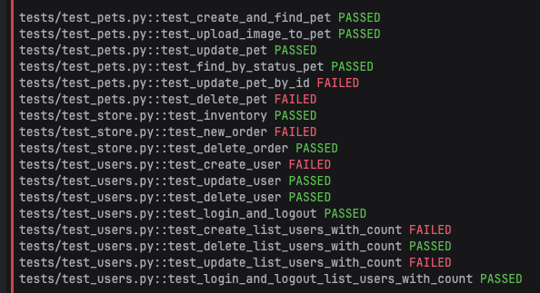
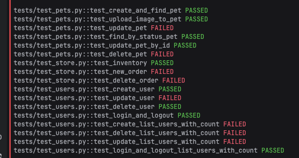
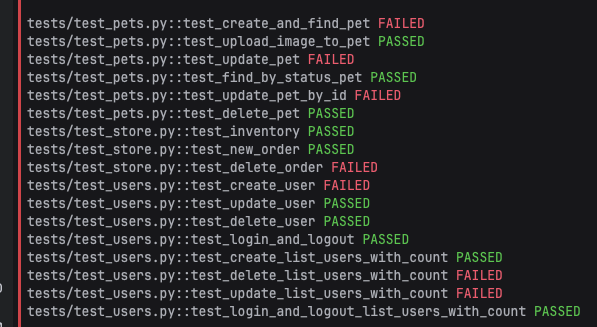
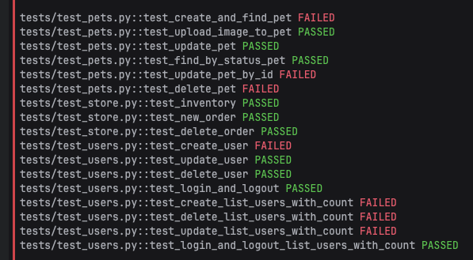
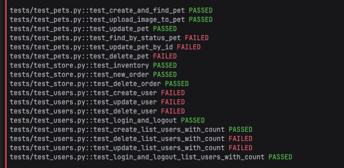
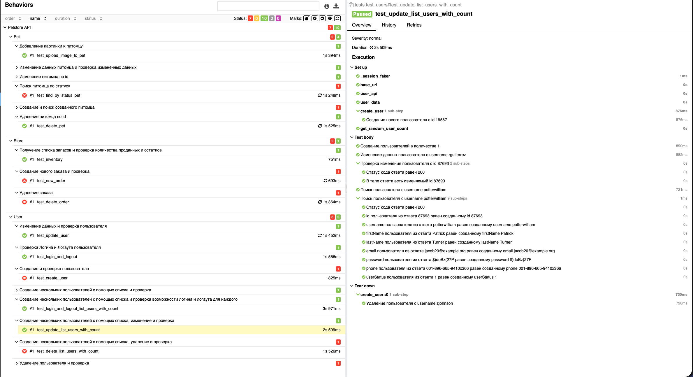

# Автотесты для Petstore API

Этот проект содержит автоматические тесты для [Swagger Petstore API](https://petstore.swagger.io/#/store). Тесты написаны на Python с использованием `pytest` и интеграцией с Allure для отчетов.

# Установка

### Проект писался на версии питон 3.10. Gоэтому есть 2 варианта установки в зависимости от используемой вами версии

### 3.10


Установка зависимостей из файла requirements.txt
```
pip install -r requirements.txt
```

### 3.9

Установка зависимостей вручную
```
# Создаем виртуальное окружение
python3 -m venv .venv

# Активируем окружение (macOS / Linux)
source .venv/bin/activate

# Активируем окружение (Windows)
.venv\Scripts\activate

# Устанавливаем зависимости
python3 -m pip install --upgrade --force-reinstall \
    pytest==7.4.4 \
    allure-pytest==2.13.2 \
    allure-python-commons==2.13.2 \
    requests==2.31.0 \
    Faker==19.13.0 \
    attrs==23.2.0 \
    pluggy==1.3.0 \
    packaging==23.2 \
    iniconfig==2.0.0 \
    charset-normalizer==3.3.2 \
    idna==3.7 \
    urllib3==1.26.18 \
    certifi==2024.8.30 \
    tomli==2.0.1 \
    typing_extensions==4.13.2 \
    tzdata==2023.3 \
    Pygments==2.17.2
```
# Запуск

1. Простой запуск тестов
```
pytest -v
```
2. Запуск тестов с формированием Allure отчета
```   
pytest --alluredir=allure-results -v
```
3. Просмотр Allure отчета
```
allure serve allure-results
```

# Важно

### Т.к. тесты написаны максимально приближено к реальным - некоторые из них иногда могут не проходить т.к. используется публичное api
### Пример - в тесте на изменение питомца (tests/test_pets.py) - test_update_pet_by_id идет следующая логика проверок - Создаем питомца -> Обновляем данные по полученному id -> Делаем запрос на получение этого питомца -> Выполняем проверки . В данном примере 2 запроса и на каждом из них api может отдать 404 (питомец не найден), хотя мы его только создали, что полностью зафейлит нам тест 

Я сделал 5 тестовых прогонов, если брать суммарно - все тесты прошли, просто в разных прогонах, кроме test_update_list_users_with_count, причина в том, что в нем используется создание сразу нескольких пользователей, после чего идет изменение каждого из них и проверка что изменения применились. Когда я его писал изначально - он проходил с 5-6 проверки т.к. там также используется генератор случайного количеста элементов. При этом в отчете allure ниже он сработал т.к. рандомное количество было 1







# Allure

Постарался расписать все шаги и проверки




# Список тестов 

### Pet
- Добавление картинки к питомцу
- Изменение данных питомца и проверка измененных данных
- Изменение питомца по id
- Поиск питомца по статусу
- Создание и поиск созданного питомца
- Удаление питомца по id
  
### Store
- Получение списка запасов и проверка количества проданных и остатков
- Создание нового заказа и проверка
- Удаление заказа 
### User
- Изменение данных и проверка пользователя
- Проверка Логина и Логаута пользователя
- Создание и проверка пользователя
- Создание нескольких пользователей с помощью списка и проверка
- Создание нескольких пользователей с помощью списка и проверка возможности логина и логаута для каждого
- Создание нескольких пользователей с помощью списка, изменение и проверка
- Создание нескольких пользователей с помощью списка, удаление и проверка
 - Удаление пользователя и проверка
